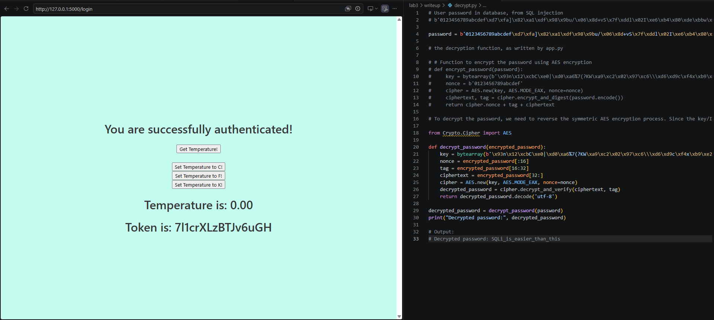
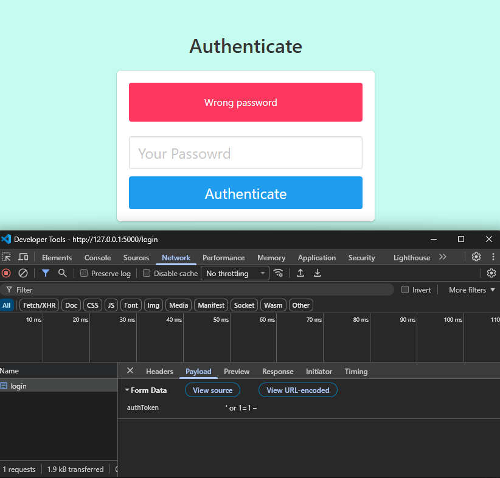

# Coding Task 1 - SQL Injection

1. Navigate to the login page


2. Post the following input

```
' or 1=1 --
```

3. Receive the following output from a successful injection attack


4. Retrieve the payload of the users table data

```
:101:b'0123456789abcdef\xd7\xfa]\x82\xa1\xdf\x98\x9bu/\x06\x8d+vS\x7f\xddl\x02I\xe6\xb4\x80\xde\xbbw\xef\x10Q\xbbR\xe5\xb7\x9eqHq\xaf}\xf8':!Q#E%T&U8i6y4r2w
```

5. Decrypt the password and login with valid credentials



6. Fix the vulnerability through SQL parameterization


7. Test the vulnerability fix by posting the same input

