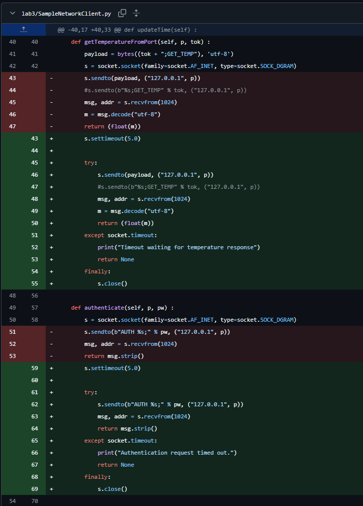

# Coding Task 1 - Vulnerabilities

## 1 - Vulnerability between run() and processCommands()

In SampleNetworkServer.py, the interaction between run() and processCommands() has a vulnerability from an authorization logic flaw due to inconsistent parsing. The run() function performs an authorization check before passing the msg to processCommands(). The processCommands can then execute multiple commands without any further authorization checks. The issue becomes apparent if a message gets passed with a LOGOUT followed by a valid token and multiple commands. When a LOGOUT command is passed, processCommands() removes the token from the valid token list. However, the processCommands() function does not exit out and continues to execute the remaining commands that were passed to it even though the token has been invalidated.

To remediate this vulnerability, the server should stop processing any commands after a LOGOUT command is processed and invalidates a session token. We did this by simply adding a return command at the end of the LOGOUT pathway so that it immediately exists.

It should be noted that if further token session-changing commands were added (e.g REAUTH, RESET_SESSION), this vulnerabiiity may become present again. Therefore, to remediate other similar potential authorization issues, the server should require revalidation whenever a session state change occurs before executing further commands. This is a future enhancement that can be implemented if those commands were to be added.


## 2 - Client Denial of Service

In SampleNetworkClient.py, the client uses UDP in authenticate() and getTemperatureFromPort(). Both methods send a message out and wait for a server response. However, the vulnerability arises when, for whatever reason, the server doesn't respond. If the server doesn't respond / the client doesn't get a response, the client will be blocked and keep waiting indefinitely. This can be exploited for a denial of service attack. 

To remediate this, we added socket timeouts to the two functions. Further downstream from those functions, we also implemented None checks in updateInfTemp and updateIncTemp to deal with what happens if the server doesn't respond.



## 3 - Hardcoded nonce value for password encryption

### Location

File: app.py

```python
nonce = b'0123456789abcdef'
cipher = AES.new(key, AES.MODE_EAX, nonce=nonce)
```

### Description

A static nonce value is used while performing the encryption of passwords using AES-EAX encryption technique. Nonce is supposed to be unique for every encryption process. The reuse of the same nonce would make the encryption less secure and would disclose the relationship among the encrypted values.

### Impact

An attacker who breaks into an encrypted password value is capable of conducting cryptanalysis on the passwords that have been stored. This compromises the confidentiality of authentication information and poses additional risks to system security.

### Fix

Generate a new random nonce for every encryption operation using:

```python
get_random_bytes(16)
```

### Testing

1. Encrypt the same password twice
2. Verify that the ciphertext values are different.
3. Confirm that authentication continues to function properly after implementing random nonce generation.

## 4 - Temperature reading timeout

###Location

File: SampleNetworkClient.py

```python
msg, addr = s.recvfrom(1024)
```

### Description
The client will be doing the blocking socket read calls without setting any time-out value. In case the server does not respond, then the application keeps on waiting for the response. This vulnerability may be exploited by an attacker.

### Impact
Users may be unable to retrieve temperature information or issue incubator commands. This can reduce availability of the monitoring system and impact patient care operations.

### Fix
Implement socket timeouts

```python
s.settimeout(3)
```

### Testing
1. Start the application normally.
2. Stop the server process.
3. Request a temperature reading.
4. Verify the application returns an error message rather than hanging indefinitely.

## 5 - MITM/Fuzzing/Chaining server commands

### Location
Files: SampleNetworkClient.py & SampleNetworkServer.py

Client:
```python
payload = bytes((tok + ";GET_TEMP"), 'utf-8')
```

Server:
```python
cmds = msg.split(';')
```

### Description
The application creates protocol messages by simply appending authentication tokens within command strings. The server uses semicolons as delimiters for the commands. A malicious user who is capable of modifying the values of these tokens could potentially add commands to the message.

### Impact
Successful command injection could allow unauthorized protocol actions, resulting in improper system behavior or unauthorized modification of incubator settings.

### Fix
Validate token values before use. Tokens should contain apprived characters and conform to an expected format

ie:
 ^[A-Za-z0-9]{16}$

### Testing
1. Attempt to submit a token containing semicolons.
2. Verify the request is rejected.
3. Confirm valid tokens continue to function correctly.