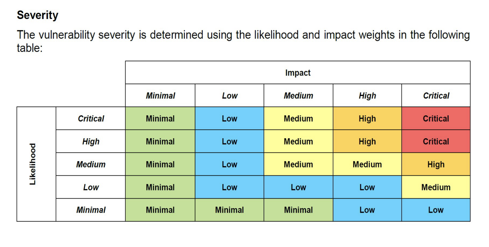

# [Lab 3](../../lab3.pdf) Writeup

This file provides guidance on how to review this Lab 3 submission.

## Risk Assessment

In reference to the following risk table:

We have the following [Risk Assessment.pdf](Risk%20Assessment.pdf).

## Coding Task 1

### SQL Injection

Review the screenshots for SQL injection, payload extraction, password decryption, and successful login in this writeup.
- [Coding Task 1 - SQLi.md](Coding%20Task%201%20-%20SQLi.md)

Review the code used to decrypt the password in decrypt.py.
- [work/decrypt.py](./work/decrypt.py)

### Vulnerabilities

Review the 5 new vulnerabilities, explanations identifying, the approach towards fixing in this writeup.
- [Coding Task 1 - Vulns.md](Coding%20Task%201%20-%20Vulns.md)

## Coding Task 2

Review the patches for hardcoded password, token list, and plaintext auth in this writeup.
- [Coding Task 2 - Vulns.md](Coding%20Task%202%20-%20Patches.md)

## Additional Notes

Review the additional notes for new dependencies and changes to running the incubator in this writeup.
- [Additional Notes.md](Additional%20Notes.md)