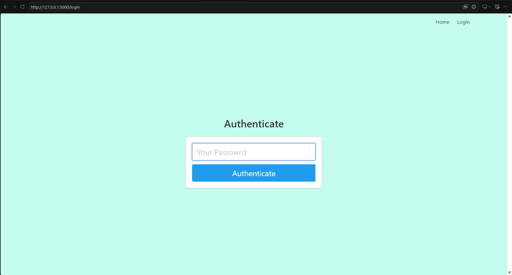
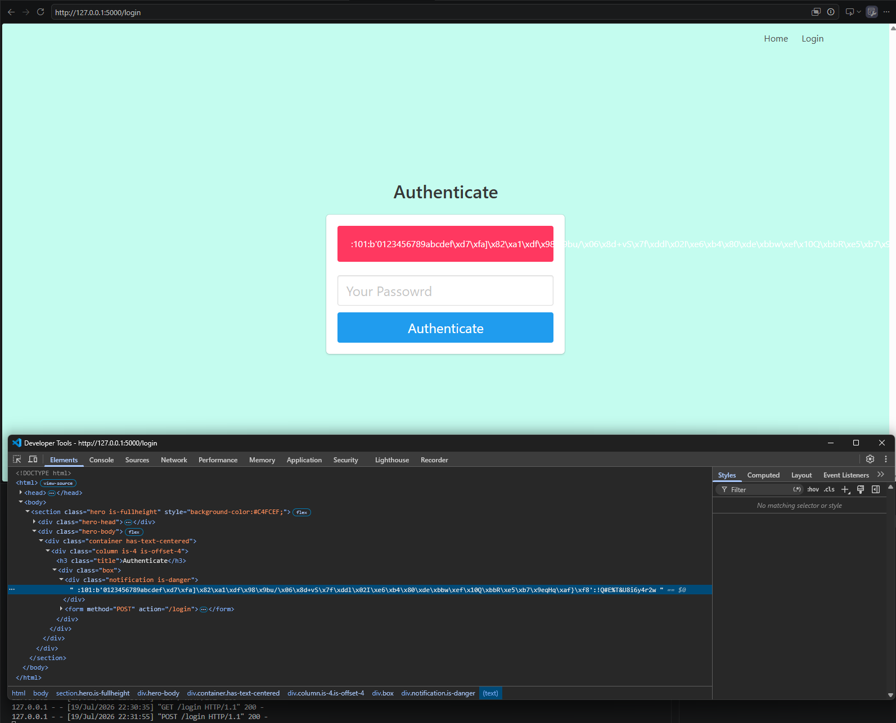
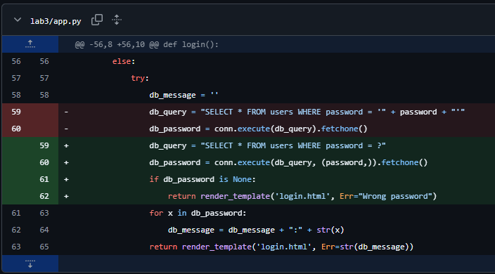

# SQL Injection Patch Screenshots

1. Navigate to the login page



2. Post the following input

```
' or 1=1 --
```

3. Receive the following output from a successful injection attack



4. Retrieve the payload of the users table data

```
:101:b'0123456789abcdef\xd7\xfa]\x82\xa1\xdf\x98\x9bu/\x06\x8d+vS\x7f\xddl\x02I\xe6\xb4\x80\xde\xbbw\xef\x10Q\xbbR\xe5\xb7\x9eqHq\xaf}\xf8':!Q#E%T&U8i6y4r2w
```

5. Decrypt the password and login with valid credentials


6. Fix the vulnerability through SQL parameterization



7. Test the vulnerability fix by posting the same input


# Test Cases

## 1. Test Case Description
Verifies whether the `/login` route's password-check query is vulnerable to
SQL injection. Specifically, checks whether submitting the payload
`' or 1=1 --` as the password can bypass authentication and return other
users' rows from the `users` table.

## 2. Pre-Condition
A `users` table exists with at least one row. The query under test is the
one currently implemented in `app.py`:
`SELECT * FROM users WHERE password = ?`, executed with the submitted
password bound as a parameter (not concatenated into the query string).

## 3. Expected Result
Submitting `' or 1=1 --` as the password should NOT return any rows,
because SQLite parameter binding treats the entire string as a literal
value to compare against the `password` column, not as SQL syntax.
Authentication should be rejected.

## 4. Actual Result
Running `sql_injection_test.py`:
- The simulated *unpatched* query (string concatenation) returns 1 row for
  the injection payload, reproducing the original vulnerability.
- The *patched* query (parameter binding, as currently written in
  `app.py`) returns 0 rows for the same payload.
- A legitimate password still returns exactly 1 matching row.

Console output:
```
BEFORE (vulnerable query): injection payload returned 1 row(s) -> vulnerability reproduced.
AFTER (patched query): injection payload returned 0 row(s) -> vulnerability is fixed.
Legitimate password still authenticates correctly after the patch.
PASS: SQL injection vulnerability is fixed.
```

## 5. Post-Condition
The injection payload is stored/compared only as literal data. No
unauthorized rows are returned, and no user is authenticated as a result
of the injection attempt. Legitimate credentials continue to authenticate
normally.

## 6. Pass/Fail
**PASS.** The patched query in `app.py` rejects the injection payload
(0 rows returned), while the reproduced unpatched version confirms the
same payload would have succeeded (1 row returned) without the fix. This
demonstrates the assertions correctly distinguish vulnerable from patched
behavior.

## 7. Explanation
The test isolates the exact query logic used by the application (rather
than mocking it) and runs the identical injection payload against both a
faithful reproduction of the original vulnerable query and the real,
current query from `app.py`. Because both versions are tested against the
same in-memory database and the same payload, any difference in results is
attributable solely to the parameterization fix, not to test setup
differences. Including the legitimate-password check also confirms the
fix does not break normal login functionality.

### New Functions
- `build_test_db()` - creates an in-memory SQLite database with a `users`
  table matching `schema.sql`, seeded with one test user. Used to isolate
  the test from the real `database.db` file.
- `vulnerable_query(conn, password)` - reproduces the original Lab 3
  vulnerable query (string concatenation) for comparison purposes only;
  not used by the live application.
- `patched_query(conn, password)` - runs the exact query currently in
  `app.py`'s `login()` function, using parameter binding.
- `test_sql_injection_patch()` - runs both queries against the same
  injection payload and asserts the patched version returns no rows while
  also confirming legitimate logins still succeed.

