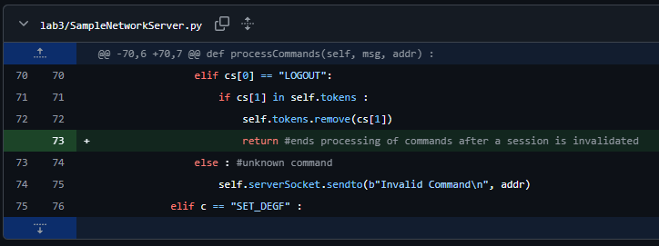

## Vulnerability between run() and processCommands()

In SampleNetworkServer.py, the interaction between run() and processCommands() has a vulnerability from an authorization logic flaw due to inconsistent parsing. The run() function performs an authorization check before passing the msg to processCommands(). The processCommands can then execute multiple commands without any further authorization checks. The issue becomes apparent if a message gets passed with a LOGOUT followed by a valid token and multiple commands. When a LOGOUT command is passed, processCommands() removes the token from the valid token list. However, the processCommands() function does not exit out and continues to execute the remaining commands that were passed to it even though the token has been invalidated.

To remediate this vulnerability, the server should stop processing any commands after a LOGOUT command is processed and invalidates a session token. We did this by simply adding a return command at the end of the LOGOUT pathway so that it immediately exists.

It should be noted that if further token session-changing commands were added (e.g REAUTH, RESET_SESSION), this vulnerabiiity may become present again. Therefore, to remediate other similar potential authorization issues, the server should require revalidation whenever a session state change occurs before executing further commands. This is a future enhancement that can be implemented if those commands were to be added.

